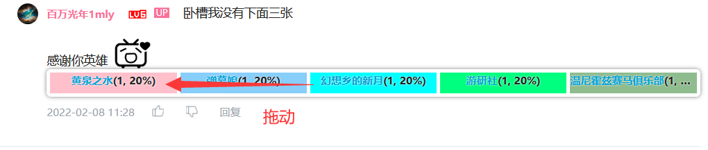

# FBIOpenTheDoor

*开门！查成分！*

统计B站评论区内用户转发动态的情况，按照原动态UP主分类。你也可以通过拖动的方式将一些分区的up主分在一起。

Github Languages风格的指示条。

经Firefox和EDGE测试正常。

### 使用方法

鼠标移动至评论区（若未显示查询入口链接，请稍等几秒待脚本识别）：

点击链接查成分！（双击链接会连续查询，直至查完所有转发的动态为止）

按UP主分类统计转发动态条数，单击UP主ID访问该UP主的空间。
拖动成分条来创建自定义集，对同一分区的UP主进行分类：

编辑自定义集的名字，修改自定义集的子成分：

### 版本历史

请查看[patch.md](patch.md)。

### 特别感谢

[原神玩家指示器](https://greasyfork.org/zh-CN/scripts/450720-%E5%8E%9F%E7%A5%9E%E7%8E%A9%E5%AE%B6%E6%8C%87%E7%A4%BA%E5%99%A8) 作者 [laupuz xu](https://greasyfork.org/zh-CN/users/954434-laupuz-xu)
