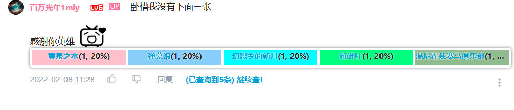

# FBIOpenTheDoor

*开门！查成分！*

统计B站评论区内用户转发动态的情况，按照原动态UP主分类。

Github Languages风格的指示条。

鼠标移动至评论区：

点击链接查成分！

按UP主分类统计转发动态条数：

### 特别感谢

[原神玩家指示器](https://greasyfork.org/zh-CN/scripts/450720-%E5%8E%9F%E7%A5%9E%E7%8E%A9%E5%AE%B6%E6%8C%87%E7%A4%BA%E5%99%A8) 作者 [laupuz xu](https://greasyfork.org/zh-CN/users/954434-laupuz-xu)

